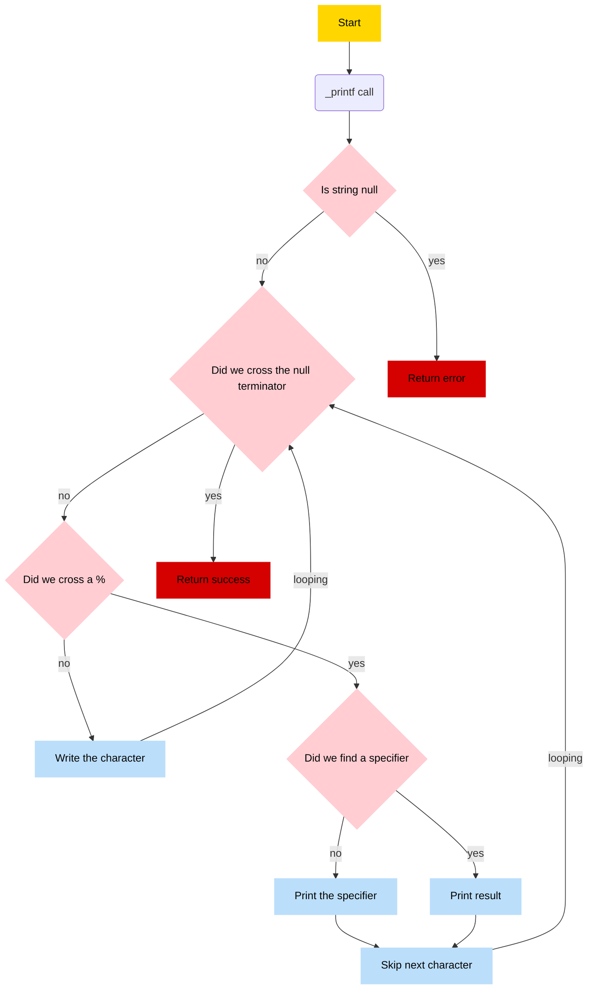

# `Printf` function

Welcome to our custom printf function project.
This is our first group project at Holberton school

## 🔖 Table of contents

<details>
  <summary>
    CLICK TO ENLARGE 😇
  </summary>
  📄 <a href="#description">Description</a>
  <br>
  🎓 <a href="#objectives">Objectives</a>
  <br>
  📋 <a href="#flowchart">Flow Chart</a>
  <br>
  📥 <a href="#installation"> Installation </a>
  <br>
  🏗️ <a href="#compilation"> Compilation </a>
  <br>
  📄 <a href="#restrictions"> Restrictions </a>
  <br>
  ⚒️ <a href="#feature"> Feature </a>
  <br>
  🔨 <a href="#tech-stack">Tech stack</a>
  <br>
  📂 <a href="#files-description">Files description</a>
  <br>
  👷🏼‍♂️👷🏼‍♂️ <a href="#authors">Authors</a>
  </details>

## 📄 <span id="description">Description</span>

_printf is a function trying to mimic the behavior of standard `printf` in C.
<br>The principal usecase of `_printf` is to print a string.

## 🎓 <span id="objectives">Objectives</span>

- This `_printf` function allow to print formatted data to the standard output.
- In mandatory task :
   - Basic conversion specifiers such as %c, %s, %i and %d
- In Advanced task :
   - %b, %o, %x, %p, and others.

## 📋 <span id="flowchart">Flow chart</span>


##  🏗️ <span id="instalation">Instalation</span>
To install, you need to clone the directory as follows:
```
git clone https://github.com/JeremyLrs/holbertonschool-printf.git
cd holbertonschool-printf
```

To use a manual :

```
sudo apt install groff /* To install Groff */
groff -Tascii -man man_3_printf /* To use manual with groff */

```

## ⚙️ <span id="compilation">Compilation</span>
The code should be compiled like this:

1. Use `make` cmd in terminal for compilate the file in .o and executable file.
   - This will generate all the executable named `.o` .
2. Use `make clean` cmd in terminal for clean all the executable file.

## 📄 <span id="restrictions">Restrictions</span>

The restrictions are as follows:

- `No more than 5 functions per file`

- `No use a global variables`

Authorized functions and macros:

- `write`
- `malloc`
- `free`
- `va_start`
- `va_end`
- `va_copy`
- `va_arg`


## ⚒️ <span id="feature">Feature</span>
### Typical usecase :

Use `_printf()` in your C programs as a direct substitute for the standard `printf` function.

``` c
#include "main.h"

int main(void)
{
  _printf ("%c\n", 'A'); /* To print a char */
  _printf ("%s\n", "My name is toto"); /* To print a string */
  _printf ("%d\n", 12345); /* To print an integer */
  _printf ("%i\n", -1); /* To print an Integer*/
  return (0);
}
```

### _printf with argument :
In `_printf` it's possible to give an infinit number of argument to the function.
To do so `_printf` is variadic function.

#### Prototype :
```c
int _printf(const char *format, ...);
```
#### Specifier :
With `_printf` it's possible to print diferent types using specifier
In order to acces a specifier it's typical to use `"%"` follow the specifier.
##### Specifier usecase with number :
``` c
#include "main.h"

int main(void)
{
  int age = 18;
  _printf("Toto age is %d years old \n", age);
  return (0);
}
```
Expected output :
`$: Toto age is 18 years old`


## 🔨 <span id="tech-stack">Tech stack</span>

<p align="left">


</p>

## 📂 <span id="files-description">File description</span>

| **FILE**            | **DESCRIPTION**                                  |
| :----------------- | ------------------------------------------------- |
| [`main.h`](https://github.com/JeremyLrs/holbertonschool-printf/blob/main/main.h)| The header file contain all the prototypes functions.      |
| [`README.md`](https://github.com/JeremyLrs/holbertonschool-printf/blob/main/README.md)| The `README.md` file.|
| [`binary_handler.c`](https://github.com/JeremyLrs/holbertonschool-printf/blob/main/binary_handler.c)| Convert unsigned int in binary depending on length (long,short,unsigned char) |
| [`binary_handler_length.c`](https://github.com/JeremyLrs/holbertonschool-printf/blob/main/binary_handler_length.c)| Provide functions for dealing with length for binary handler|
| [`convert_base.c`](https://github.com/JeremyLrs/holbertonschool-printf/blob/main/convert_base.c)| convert unsigned int in to givent (binary, octale, haxadecimal).|
| [`custom_handler_string.c`](https://github.com/JeremyLrs/holbertonschool-printf/blob/main/custom_handler_string.c)| Create string givent argument into a string where special char are converted in hexa |
| [`final_handler.c`](https://github.com/JeremyLrs/holbertonschool-printf/blob/main/final_handler.c)| Functions to apply width flags and precision |
| [`flag_handler.c`](https://github.com/JeremyLrs/holbertonschool-printf/blob/main/flag_handler.c)| Function to deal with flag |
| [`flag_helper.c`](https://github.com/JeremyLrs/holbertonschool-printf/blob/main/flag_helper.c)| Provide functions for dealing with flag handler|
| [`get_print_function.c`](https://github.com/JeremyLrs/holbertonschool-printf/blob/main/get_print_function.c)| Function that returns a pointer to a function handler.|
| [`hexa_lowercase_handler.c`](https://github.com/JeremyLrs/holbertonschool-printf/blob/main/hexa_lowercase_handler.c)| Convert unsigned int in lowercase hexadecimal depending on length (long,short,unsigned char)|
| [`hexa_lowercase_handler_length.c`](https://github.com/JeremyLrs/holbertonschool-printf/blob/main/hexa_lowercase_handler_length.c)|Provide functions for dealing with length for hexa lowercase handler|
| [`hexa_uppercase_handler.c`](https://github.com/JeremyLrs/holbertonschool-printf/blob/main/hexa_uppercase_handler.c)| Convert unsigned int in uppercase hexadecimal depending on length (long,short,unsigned char)|
| [`hexa_uppercase_handler_length.c`](https://github.com/JeremyLrs/holbertonschool-printf/blob/main/hexa_uppercase_handler_length.c)| Provide functions for dealing with length for hexa uppercase handler|
| [`int_handler.c`](https://github.com/JeremyLrs/holbertonschool-printf/blob/main/int_handler.c)| Convert a char or int in string |
| [`int_handler_length.c`](https://github.com/JeremyLrs/holbertonschool-printf/blob/main/int_handler_length.c)| Provide functions for dealing with length for integer handler |
| [`int_helper.c`](https://github.com/JeremyLrs/holbertonschool-printf/blob/main/int_helper.c)| Function to provide the size to make a string |
| [`length_handler.c`](https://github.com/JeremyLrs/holbertonschool-printf/blob/main/length_handler.c)| Function to deal with length |
| [`main.h`](https://github.com/JeremyLrs/holbertonschool-printf/blob/main/main.h)|Header file containting structurs, handler function and their helpers|
| [`octal_handler.c`](https://github.com/JeremyLrs/holbertonschool-printf/blob/main/octal_handler.c)| Convert unsigned int in octale depending on length (long,short,unsigned char)|
| [`octal_handler_length.c`](https://github.com/JeremyLrs/holbertonschool-printf/blob/main/octal_handler_length.c)|Provide functions for dealing with length for octal handler |
| [`pointer_handler.c`](https://github.com/JeremyLrs/holbertonschool-printf/blob/main/pointer_handler.c)| Provide string of a pointer in hexa|
| [`precision_handler.c`](https://github.com/JeremyLrs/holbertonschool-printf/blob/main/precision_handler.c)|Function to deal with precision |
| [`printf_factory.c`](https://github.com/JeremyLrs/holbertonschool-printf/blob/main/printf_factory.c)| Function that mimics printf behavior |
| [`putchar_helper.c`](https://github.com/JeremyLrs/holbertonschool-printf/blob/main/putchar_helper.c)|Function that provide buffering and printing for string |
| [`reversed_string_handler.c`](https://github.com/JeremyLrs/holbertonschool-printf/blob/main/reversed_string_handler.c)| Function that return a revers string |
| [`rot13_handler.c`](https://github.com/JeremyLrs/holbertonschool-printf/blob/main/rot13_handler.c)| Convert string in rot13 |
| [`string_handler.c`](https://github.com/JeremyLrs/holbertonschool-printf/blob/main/string_handler.c)|Provide the copy of string |
| [`string_helper.c`](https://github.com/JeremyLrs/holbertonschool-printf/blob/main/string_helper.c)| Provide utility function for string operations |
| [`unsigned_int_handler.c`](https://github.com/JeremyLrs/holbertonschool-printf/blob/main/unsigned_int_handler.c)| Convert a unsigned int in string |
| [`unsigned_int_handler_length.c`](https://github.com/JeremyLrs/holbertonschool-printf/blob/main/unsigned_int_handler_length.c)| Provide functions for dealing with length for unsigned int handler |
| [`unsigned_int_helper.c`](https://github.com/JeremyLrs/holbertonschool-printf/blob/main/unsigned_int_helper.c)| Function to provide the size to make a string for unsigned int |
| [`width_handler.c`](https://github.com/JeremyLrs/holbertonschool-printf/blob/main/width_handler.c)| Function to deal with width|
| [`man_3_printf`](https://github.com/JeremyLrs/holbertonschool-printf/blob/main/man_3_printf)| Manual page of our function `printf`.| 

## 👷🏼‍♂️👷🏼‍♂️ <span id="authors">Authors</span>

**👷🏼‍♂️ Adel MEJRISSI**
- GitHub: [@AdelMej](https://github.com/AdelMej)
- LinkedIn: [@adel-mejrissi](https://www.linkedin.com/in/adel-mejrissi-709374172/)

**👷🏼‍♂️ Jérémy LAURENS**
- GitHub: [@JeremyLrs](https://github.com/JeremyLrs)
- LinkedIn: [@jeremylrs](www.linkedin.com/in/jeremylrs)
